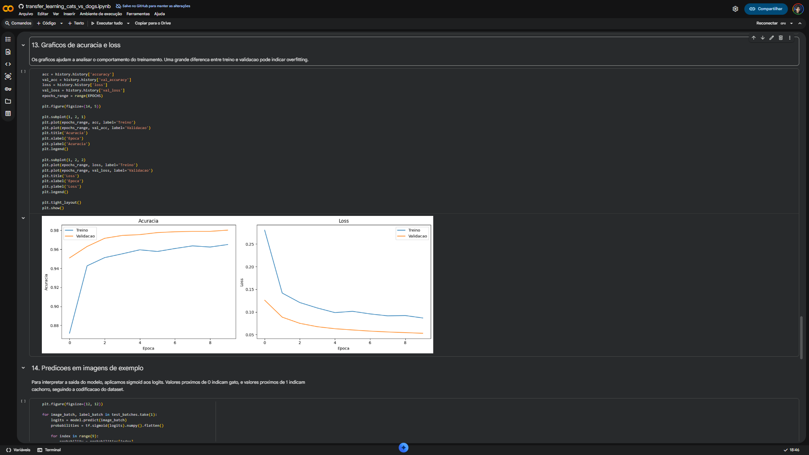
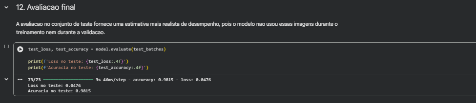
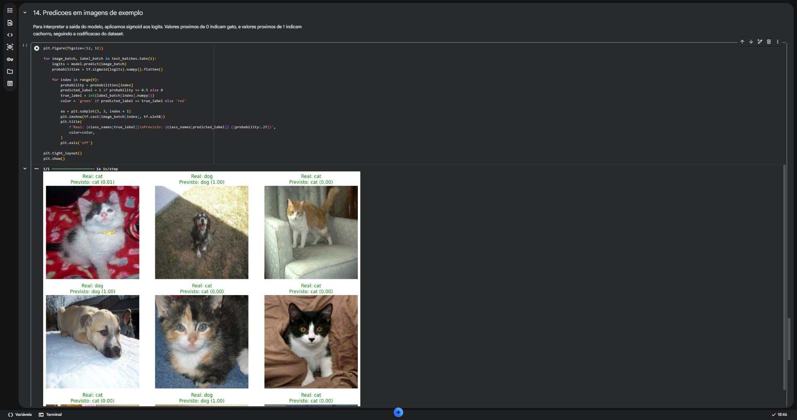

# transfer learning com gatos e cachorros

projeto de classificação de imagens desenvolvido para o desafio da dio, usando **transfer learning** com mobilenetv2, tensorflow e o dataset `cats_vs_dogs`.

a ideia aqui foi construir um notebook simples de acompanhar, mas completo o suficiente para mostrar o fluxo real de um projeto de visão computacional: carregar os dados, preparar as imagens, reaproveitar um modelo pré-treinado, treinar a camada final e avaliar os resultados.

## objetivo

classificar imagens de gatos e cachorros usando uma rede neural pré-treinada.

em vez de treinar uma cnn do zero, o projeto usa a mobilenetv2 como base para extração de características. a partir dela, foi adicionada uma cabeça de classificação para adaptar o modelo ao problema binário.

o notebook foi montado para rodar bem no google colab, mas também pode ser executado localmente com python e jupyter.

## tecnologias

- python
- tensorflow
- keras
- tensorflow datasets
- numpy
- matplotlib
- jupyter notebook
- google colab

## transfer learning

transfer learning é uma forma de reaproveitar o que um modelo já aprendeu em uma tarefa maior e aplicar esse conhecimento em outro problema.

neste projeto, a mobilenetv2 entra com pesos pré-treinados na imagenet. isso significa que ela já aprendeu padrões visuais úteis, como bordas, texturas, formas e combinações mais complexas de objetos.

para o problema de gatos e cachorros, esse reaproveitamento faz sentido porque o modelo não começa do zero. ele já sabe extrair boas características das imagens, e o treinamento fica concentrado em ajustar a parte final para separar as duas classes.

## dataset

o dataset usado foi o `cats_vs_dogs`, disponível pelo `tensorflow_datasets`.

ele contém imagens reais de gatos e cachorros em diferentes poses, tamanhos, iluminações e cenários. essa variação torna o conjunto interessante para testar um modelo de classificação de imagens de forma um pouco mais próxima de um caso real.

no notebook, os dados são divididos em treino, validação e teste. antes do treinamento, as imagens passam por redimensionamento, normalização e data augmentation.

## estrutura

```text
transfer-learning-cats-vs-dogs-dio/
├── readme.md
├── requirements.txt
├── transfer_learning_cats_vs_dogs.ipynb
├── .gitignore
└── images/
    ├── accuracy_loss.png
    ├── final_accuracy.png
    └── predictions.png
```

## etapas

1. preparação do ambiente no google colab.
2. importação das bibliotecas.
3. carregamento do `cats_vs_dogs` com tensorflow datasets.
4. separação dos dados em treino, validação e teste.
5. redimensionamento e normalização das imagens.
6. aplicação de data augmentation.
7. visualização de amostras do dataset.
8. carregamento da mobilenetv2 com pesos da imagenet.
9. congelamento da base convolucional.
10. criação da cabeça de classificação.
11. compilação e treinamento do modelo.
12. avaliação no conjunto de teste.
13. visualização das curvas de acurácia e loss.
14. teste com predições em imagens de exemplo.

## resultados

o modelo teve um bom desempenho para a tarefa proposta. a mobilenetv2 conseguiu extrair características visuais fortes, e a camada final aprendeu a separar as classes com boa precisão.

resultados aproximados no conjunto de teste:

- acurácia: **98,15%**
- loss: **0,0476**

### acurácia e loss



### acurácia final



### exemplos de predição



## como executar

abra o notebook `transfer_learning_cats_vs_dogs.ipynb` no google colab e execute as células em ordem.

para melhor desempenho, use gpu:

```text
ambiente de execução > alterar tipo de ambiente de execução > gpu
```

para rodar localmente, instale as dependências:

```bash
pip install -r requirements.txt
```

depois disso, abra o notebook em um ambiente jupyter.

## conclusão

este projeto mostra como transfer learning pode acelerar bastante o desenvolvimento de um classificador de imagens.

com a mobilenetv2 pré-treinada, foi possível chegar a uma boa acurácia sem precisar treinar uma rede profunda do zero. o resultado é um notebook direto, reproduzível e útil tanto como entrega para a dio quanto como projeto de portfólio.

## melhorias futuras

- fazer fine-tuning nas últimas camadas da mobilenetv2.
- comparar o resultado com arquiteturas como efficientnet e resnet.
- adicionar matriz de confusão.
- incluir relatório de classificação com precision, recall e f1-score.
- salvar o modelo treinado em `.keras` ou `savedmodel`.
- criar uma interface simples com streamlit ou gradio.
- testar imagens externas enviadas pelo usuário.
- automatizar experimentos com diferentes taxas de aprendizado e tamanhos de batch.
